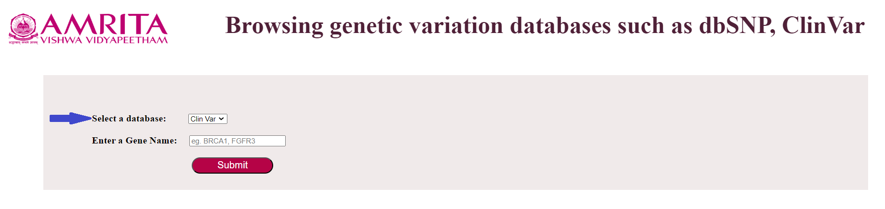
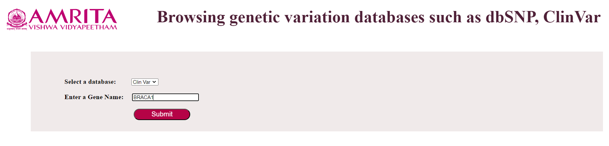
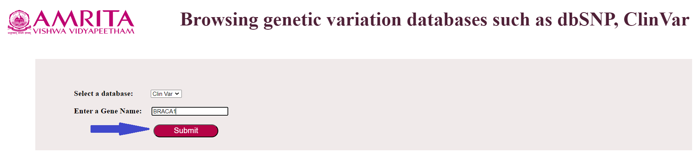
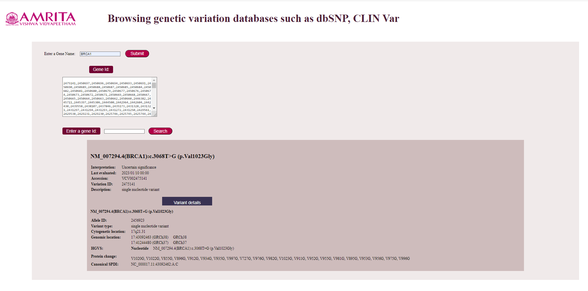

### Procedure

The graphical user interface helps users learn how to browse a bioinformatics tool, a human genetic variation database ClinVar. The ClinVar simulator provides the variant details such as Allele ID, Variant type, Cytogenetic location, Genomic location, HGVS, Protein change, Canonical SPDI, etc. The graphical user interface helps the users to identify the genetic variants associated with specific diseases and helps to determine the clinical significance of these variants. The steps to use the simulator are as follows:

1.	Open the simulator window

 

2.	Users must select the Genetic Variation database, ClinVar, by clicking the “select a database” button.

3.	Users must enter a gene name in the second tab (Enter a Gene Name button) provided in the simulator. For example, BRCA1 gene name was entered in the GUI

4.	Click the Submit button to get the gene's variation Id (Here BRCA1). 
  •	A variation ID refers to a unique identifier assigned to a specific variant or genetic variant reported in the ClinVar database.

5.  After clicking the Submit button, the simulator provides different Variant IDs of the given gene (Here GUI provides different variation IDs of BRCA1 GENE).

6.  After getting the different variation IDs of the gene, the User has to enter a variation id in the ‘Enter a Variation Id’ tab to get more details relating to the gene’s genetic variant. For example, a variation Id, 2501193 of the BRCA1 gene is entered in the tab.

7. After entering the variation ID, the user has to click on the ‘Search button’ to get the details (Allele ID, Variant type, Cytogenetic location, Genomic location, HGVS, Protein change, Canonical SPDI) of the given genetic variant.
Here BRCA1 gene with a variant id 2501193 provides the details such as:
NM_007294.4(BRCA1):c.5502_5503del (p.Glu1836fs)
Interpretation:     	 Likely pathogenic
Last evaluated:     	 2023/03/30 00:00
Accession:     	             VCV002501193
Variation ID:     	 2501193
Description:     	           Deletion

Variant Details
NM_007294.4(BRCA1):c.5502_5503del (p.Glu1836fs)
Allele ID:     	            2524085
Variant type:     	            Deletion
Cytogenetic location:    17q21.31
Genomic location:         17:43045768 (GRCh38)     GRCh3817:41197785 (GRCh37)     GRCh37
HGVS:     	             Nucleotide     NM_007294.4(BRCA1):c.5502_5503del (p.Glu1836fs)
Protein change:     	
E1539fs, E1540fs, E1667fs, E1682fs, E1707fs, E1708fs, E1709fs, E1723fs, E1724fs, E1725fs, E1746fs, E1747fs, E1748fs, E1752fs, E1764fs, E1765fs, E1766fs, E1767fs, E1768fs, E1769fs, E1787fs, E1788fs, E1789fs, E1792fs, E1793fs, E1794fs, E1795fs, E1808fs, E1809fs, E1810fs, E1816fs, E1817fs, E1831fs, E1832fs, E1833fs, E1834fs, E1835fs, E1836fs, E1856fs, E1857fs, E1858fs, E424fs, E556fs, E565fs, E605fs, E606fs, E619fs, E620fs, E623fs, E624fs, E643fs, E644fs, E645fs, E651fs, E653fs, E661fs, E662fs, E663fs, E665fs, E666fs, E684fs, E685fs, E686fs, E688fs, E690fs, E691fs, E692fs, E693fs, E694fs, E706fs, E707fs, E708fs, E729fs, E730fs, E731fs, E732fs, E733fs, E754fs, E755fs, E967fs, E968fs
Canonical SPDI:     	NC_000017.11:43045766:GGG:G

 

8. After getting the details of the variant, the User can go to the home page by clicking on the Reset button.

