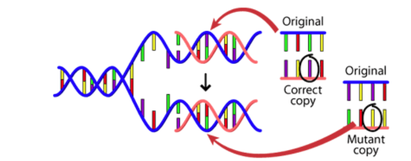
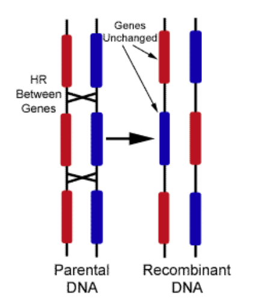
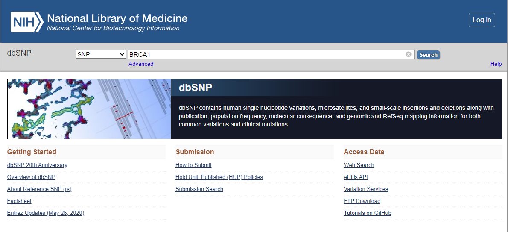
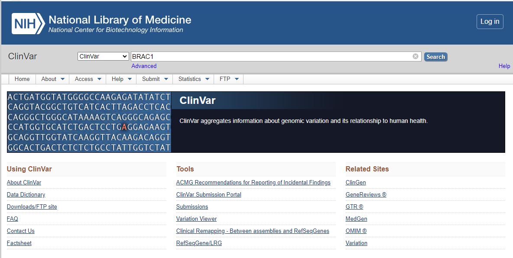

### Introduction

Understanding human genetic variations using advanced technologies provides insight into an individual's genetic makeup and how their genes are expressed, regulated, and modified. Genetic variation refers to the natural differences between individuals within a population regarding their DNA sequence. Genes are inherited DNA segments containing protein-coding information that transform from one generation to the next. Genetic studies reveal that most variation occurs in Germ and somatic cells. The variation in germ cells can be inherited from one individual to another, affecting population dynamics and evolution. Variants and alleles are two critical scientific terms commonly used in a genetic study. The term variant is referred to a specific region of the genome that differs between two genomes, whereas different versions of the same variant are called alleles. Alleles are the key factor determining the features which can be passed from parents to children.

Genetic variation is the fundamental source of natural selection as it enhances or reduces the frequency of alleles. The variation in genetic material is beneficial in some cases as it allows certain population dynamics to adapt and survive in the changing environment. Genetic variations occur mainly due to mutations and genetic recombination.

    • Mutations are changes that occur in the DNA sequence, either spontaneously or because of exposure to mutagens, such as radiation or chemicals. Mutations can be beneficial, harmful, or neutral, depending on the location and nature of the change (Fig.1).

Fig 1.Mutation in the DNA segment leads to Genetic Variation

Image source: https://evolution.berkeley.edu/evolution-101/mechanisms-the-processes-of-evolution/the-causes-of-mutations/

    • Genetic recombination occurs during meiosis, in which cells divide to produce eggs or sperm. During meiosis, homologous chromosomes exchange genetic material, resulting in new combinations of alleles (variants of genes) in the offspring.

Fig 2. Genetic Recombination leads to variation

Image Source: http://creationwiki.org/File:Crossover.gif

&nbsp;

Genetic variation is responsible for the differences we see between individuals in terms of physical traits, such as height, eye color, and skin color. It also plays a crucial role in disease susceptibility and drug response. Understanding genetic variation is essential for medical research, as it helps scientists develop personalized medicine and therapies that can be tailored to individual patients based on their genetic makeup. Genetic variation studies also aid evolutionary studies, forensic investigations, and agriculture and animal breeding.

&nbsp;

### Genetic Variation Databases	

A genetic variation database is a collection of data on genetic variants in a particular population or species. The database provides a standardized framework to describe variants associated with a specific trait. The database typically includes information on location, frequency, and functional impact of genetic variants. It also contains annotations on the clinical significance of genetic variants, such as their associations with different diseases and the evidence supporting them.

Genetic variation databases can be helpful for various purposes, including research, clinical diagnosis, and drug development. For example, researchers may use genetic variation databases to identify genetic variants associated with specific diseases or traits and understand the genetic basis of these conditions. Clinicians may use genetic variation databases to interpret genetic test results and make more informed patient care decisions. Drug developers may use genetic variation databases to identify drug targets and develop personalized treatments tailored to an individual's genetic makeup. These databases are typically maintained by government agencies, research institutions, or private companies and are freely available to researchers, clinicians, and the public. Various bioinformatics databases were available for handling large amounts of genome-scale data. 

Some of them are:

    •	1000 Genomes Project: This project was designed to catalog genetic variations in the genomes of over 2,500 individuals from around the world.

    •	ExAC: The Exome Aggregation Consortium database contains information on genetic variations found in the exomes of over 60,000 individuals.

    •	gnomAD: This database contains information on genetic variations found in over 140,000 exomes and 15,000 whole genomes.

    •	dbSNP: This is the largest public database of genetic variations, containing information on over 151 million variations.

    •	ClinVar: This database focuses on genetic variations that are known to be associated with human disease. It contains information on over 500,000 variants.

These databases are valuable resources for researchers and clinicians who are studying human genetics and working to develop new treatments for genetic diseases. They allow researchers to compare genetic variations across populations, identify new disease-associated variants, and better understand the underlying mechanisms of genetic diseases.

&nbsp;

### Insights to dbSNP and ClinVar Database

#### Single Nucleotide Polymorphism database:

dbSNP (Single Nucleotide Polymorphism database) is a public database maintained by the National Center for Biotechnology Information (NCBI), a division of the National Institutes of Health (NIH). It is one of the most widely used databases for human genetic variation. The dbSNP database contains information about genetic variations in the human genome, including single nucleotide polymorphisms (SNPs), small insertions and deletions (indels), and larger structural variations. (Fig.3) It also includes information about the frequency of these variations in different populations, their functional effects, and their associations with various diseases.

The database is regularly updated and currently contains information on more than 150 million genetic variations, making it one of the largest and most comprehensive resources for studying human genetic variation. The data in dbSNP are derived from various sources, including research studies, public databases, and commercial genotyping arrays. One of the main uses of dbSNP is to facilitate the identification of genetic variations that are associated with disease. Researchers can use the database to search for known disease-associated variants or identify novel variants associated with a particular disease. The database can also be used to study population genetics and human evolution, as it contains information on the frequency of genetic variants in different populations around the world.

dbSNP is freely available and can be accessed through the NCBI website. It is a valuable resource for genetics, genomics, and medicine researchers interested in studying human genetic variation and its impact on health and disease.

 

Fig.3: Browsing of a gene BRAC1 with a variant type SNV using dbSNP database via NCBI

&nbsp;

#### ClinVar (Clinical Variation) Database:

ClinVar is a public database of genetic variants and their associations with human diseases. It is maintained by the National Center for Biotechnology Information (NCBI), a division of the National Institutes of Health (NIH). (Fig.4) The database is a collaborative effort involving many organizations and institutions, including clinical labs, research centers, and patient advocacy groups. ClinVar contains information about the clinical significance of genetic variants, including their associations with different diseases, the evidence supporting these associations, and the interpretation of their impact on human health. The database also includes information about the frequency of these variants in different populations and whether they are benign, likely benign, uncertain significance, likely pathogenic, or pathogenic. ClinVar is an important resource for researchers, clinicians, and patients interested in understanding the genetic basis of human diseases. It allows users to search for genetic variants of interest and to view information about their clinical significance and interpretation. It also provides a platform for submitting new data and evidence about genetic variants, which can help improve the database's accuracy and completeness.

One of the primary uses of ClinVar is to support clinical decision-making in diagnosing and treating genetic diseases. Clinicians can use the database to identify genetic variants that are associated with specific ailments and to determine the clinical significance of these variants. Patients can also use the database to understand their genetic risks better and inform their healthcare decisions. The database is freely available and can be accessed through the NCBI website. It is a valuable resource for anyone interested in studying the genetic basis of human diseases and improving the accuracy and completeness of genetic variant interpretation.

 

Fig.4: Browsing of a gene BRAC1 with a variant type SNV using ClinVar database via NCBI

